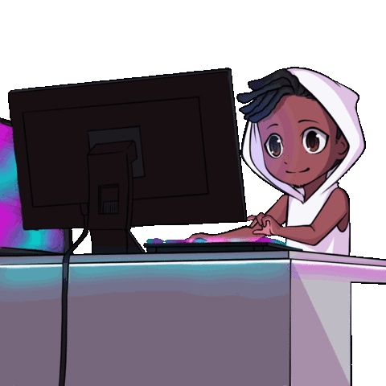

import { useState } from "react";

export function Center({ children }) {
  
  return (
    

      {children}
    

);
}

# Acerca del desarrollador

## ꧁ Hola!! ꧂

- 👋 Me llamo Edison López y soy un desarrollador de software apasionado por la creación de soluciones tecnológicas que mejoren la vida de las personas.
- 💻 Mi experiencia en el campo de la ingeniería de software me ha permitido trabajar en proyectos diversos, desde aplicaciones móviles hasta sistemas de gestión empresarial.
- 🌎 Vivo en Ecuador, pero tengo la capacidad de trabajar con personas y equipos de todo el mundo.
- 🔍 Siempre estoy en busca de nuevos retos y oportunidades para seguir creciendo profesionalmente y mejorar mis habilidades como desarrollador.
- 📧 ¿Quieres ponerte en contacto conmigo? Puedes escribirme a mi correo electrónico edisonlopezec@gmail.com. ¡Estaré encantado de conversar contigo!

## Mi web

https://edisonlg-ec.vercel.app/
