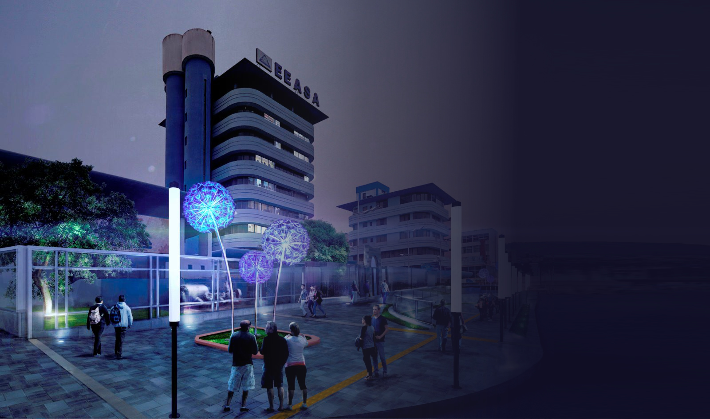

# **Introducción a la Plataforma de Mesa de Ayuda de la Empresa Eléctrica Ambato**

**¡Bienvenido a la documentación oficial de la _Plataforma de Mesa de Ayuda_ de la _Empresa Eléctrica Ambato_!**

🌟 Esta plataforma innovadora ha sido diseñada y desarrollada para **optimizar y agilizar el proceso de gestión de incidencias y solicitudes**, brindando a la organización la capacidad de atender de manera eficiente las necesidades de sus clientes y usuarios internos.

La **Plataforma de Mesa de Ayuda** fusiona la potencia de la tecnología _front-end_ basada en **React** con la robustez del _back-end_ basado en el framework **Spring**. Este enfoque integral proporciona una solución completa y escalable que permite la **captura, seguimiento y resolución efectiva de incidencias y solicitudes**, mientras facilita la administración de un **tablero Kanban personalizable** que refleja el flujo de trabajo único de la _Empresa Eléctrica Ambato_.

## **Características Destacadas**:

1. **_Gestión de Correos Electrónicos Eficiente:_** La plataforma es capaz de recibir y procesar correos electrónicos enviados a una dirección designada, creando automáticamente incidencias y permitiendo una rápida asignación a los equipos responsables.

2. **_Tablero Kanban Personalizable:_** Nuestro tablero Kanban integrado ofrece una **vista visual** de las incidencias en diferentes estados, permitiendo una gestión eficaz y la monitorización constante del progreso. Cada incidencia puede ser **categorizada, asignada a roles específicos** y avanzar a través de estados predefinidos.

3. **_Interfaz React Intuitiva:_** La interfaz _front-end_ basada en React proporciona una **experiencia de usuario fluida y atractiva**. Los componentes reutilizables permiten una **navegación intuitiva** y una **interacción eficiente** con las funcionalidades de la plataforma.

4. **_Integración con Spring Back-End:_** El sólido _back-end_ construido en el framework Spring garantiza la **seguridad de los datos**, la gestión de transacciones y la **integración perfecta con bases de datos**. La comunicación entre el _front-end_ y el _back-end_ se realiza a través de una **API RESTful**, asegurando un flujo de datos consistente y seguro.

5. **_Seguridad y Privacidad:_** Reconociendo la importancia de la **seguridad de los datos**, la plataforma implementa medidas de seguridad avanzadas para proteger la información sensible de nuestros usuarios y la **confidencialidad de las incidencias en curso**.

## **Guía de Usuario**

Esta documentación está diseñada para guiar a los usuarios a través de todas las **funcionalidades de la Plataforma de Mesa de Ayuda de la Empresa Eléctrica Ambato**. Desde la **instalación y configuración inicial** hasta la **gestión diaria de incidencias** y la **personalización del tablero Kanban**, cada sección proporcionará **información detallada y pasos prácticos** para garantizar un **uso efectivo y eficiente** de la plataforma.

**Le agradecemos por confiar en nuestra solución tecnológica para mejorar la gestión de incidencias y las operaciones en la Empresa Eléctrica Ambato.** Juntos, estamos dando paso a una forma **más inteligente y ágil** de abordar las necesidades de nuestros clientes y usuarios internos. 💡🚀

