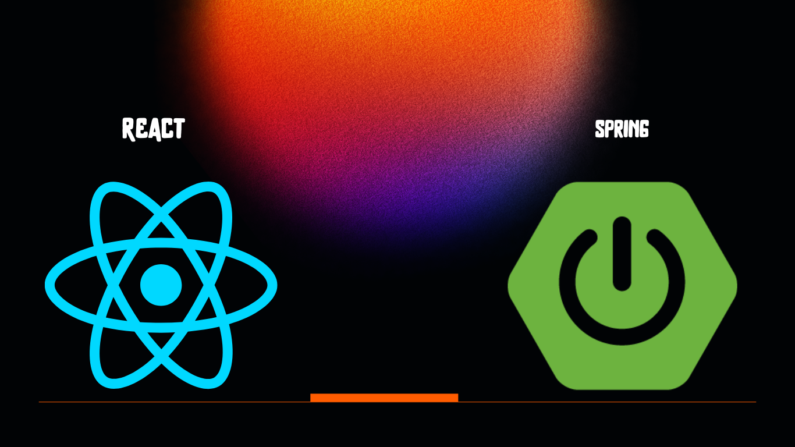

# **Tecnologías Utilizadas en el Proyecto:**

La **Plataforma de Mesa de Ayuda de la Empresa Eléctrica Ambato** se ha desarrollado utilizando una combinación de tecnologías modernas en el ámbito del desarrollo web y empresarial. Estas tecnologías se han seleccionado cuidadosamente para garantizar un rendimiento sólido, una experiencia de usuario excepcional y una seguridad robusta en todos los aspectos del proyecto. A continuación, se detallan las principales tecnologías utilizadas:

1. **React:**
   React, una biblioteca de JavaScript de código abierto desarrollada por Facebook, se utiliza para construir la interfaz de usuario interactiva y dinámica de la plataforma. React ofrece una estructura de componentes reutilizables que permiten una construcción modular y una actualización eficiente de la interfaz.

2. **Spring Framework:**
   Spring Framework, un marco de desarrollo de aplicaciones Java de renombre mundial, es la piedra angular del back-end de la plataforma. Proporciona una infraestructura sólida para el manejo de transacciones, la seguridad, la gestión de datos y la integración con otras tecnologías.

3. **API RESTful:**
   La comunicación entre el front-end y el back-end se realiza a través de una API RESTful. Esta arquitectura permite una comunicación eficiente y estructurada entre los componentes de la plataforma, garantizando la coherencia de los datos y las interacciones.

4. **Base de Datos Relacional:**
   Se utiliza una base de datos relacional para almacenar y administrar los datos esenciales de la plataforma. La elección de la base de datos proporciona un almacenamiento estructurado y confiable para las incidencias, los usuarios y otros elementos relevantes.

5. **Tablero Kanban Personalizado:**
   Para la implementación del tablero Kanban interactivo, se emplean tecnologías front-end que aprovechan las capacidades de React. Componentes específicos se desarrollan para gestionar la visualización y la interacción de las incidencias en diferentes estados.

6. **Seguridad y Autenticación:**
   Se implementan protocolos de seguridad y autenticación sólidos para proteger los datos y garantizar el acceso adecuado a las funcionalidades de la plataforma. La tecnología empleada en esta área asegura la privacidad y la integridad de la información.

7. **Herramientas de Desarrollo y Despliegue:**
   Para el desarrollo y el despliegue eficiente de la plataforma, se utilizan herramientas que optimizan el flujo de trabajo. Estas herramientas incluyen entornos de desarrollo integrados (IDE), sistemas de control de versiones y servidores de aplicaciones compatibles con archivos WAR.

8. **Bibliotecas y Frameworks Adicionales:**
   Además de las tecnologías principales, se utilizan bibliotecas y frameworks complementarios que mejoran la funcionalidad y la estética de la plataforma. Estas herramientas adicionales garantizan una experiencia de usuario rica y satisfactoria.

La selección de estas tecnologías ha sido estratégica para cumplir con los objetivos del proyecto y brindar una solución sólida y escalable a la Empresa Eléctrica Ambato. Cada componente tecnológico se ha integrado de manera cohesiva para crear una plataforma de mesa de ayuda que optimiza la gestión de incidencias y mejora la eficiencia operativa.
