# ¡Bienvenido a la Sección de Mockups e Interfaz!

¡Descubre nuestro proyecto innovador que fusiona la agilidad de **React** en el _front-end_ con la potencia de **Spring** en el _back-end_!

A través de este archivo `.war`, presentamos una solución de **vanguardia** diseñada para potenciar la gestión de soporte y comunicación en la **_Empresa Eléctrica Ambato_**.

## Imagina la Revolución

Imagina una plataforma en línea que **revoluciona** la manera en que se manejan las incidencias y se facilita la comunicación. Nuestra aplicación transforma correos enviados a una dirección específica en _incidencias automáticas y administrables_.

Pero eso no es todo, también introduce un **tablero Kanban interactivo** con características avanzadas, como _estados personalizados_, _categorías detalladas_, _roles diferenciados_ ¡y mucho más!

## React en el Front-End, Spring en el Back-End

Con **React** en el _front-end_, hemos creado una **interfaz de usuario moderna e interactiva**. Sus componentes reutilizables y su enfoque declarativo han dado forma a una experiencia fluida.

Por otro lado, **Spring** en el _back-end_ proporciona una **estructura robusta** para manejar la lógica empresarial, garantizando seguridad y escalabilidad.

## Explora y Descubre

En esta sección, explora nuestros **mockups** y la **interfaz cuidadosamente diseñada**. Desde la _automatización de incidencias_ hasta la _gestión de roles_ y el _tablero Kanban_, cada detalle busca optimizar la productividad en la **_Empresa Eléctrica Ambato_**.

¡Descubre cómo la fusión de **React** y **Spring** redefine la gestión de incidencias y facilita la colaboración! Te invitamos a explorar las _páginas de usuarios_, conocer flujos de trabajo y experimentar la **transformación digital** en la gestión empresarial.

## Inicio de Sesión

Le damos la bienvenida a la página de inicio de sesión de nuestra plataforma. Aquí, le brindamos un acceso seguro y eficiente a todas las funciones y capacidades que nuestra aplicación tiene para ofrecer.

Nuestro sistema de inicio de sesión se basa en un mecanismo de token, un código único que otorga acceso controlado a los usuarios. Estos tokens cuentan con una ventana de tiempo limitada, garantizando la seguridad de la plataforma y protegiendo sus datos. Además de brindar autenticación, estos tokens permiten la ejecución segura de las peticiones en el back-end.

Le invitamos a ingresar con sus credenciales y experimentar la forma en que nuestra plataforma garantiza la seguridad y la agilidad en el acceso. Descubra cómo nuestra implementación de tokens mejora la experiencia del usuario y protege sus interacciones en línea.

Acceda con confianza y explore todas las posibilidades que nuestra plataforma tiene reservadas para usted.

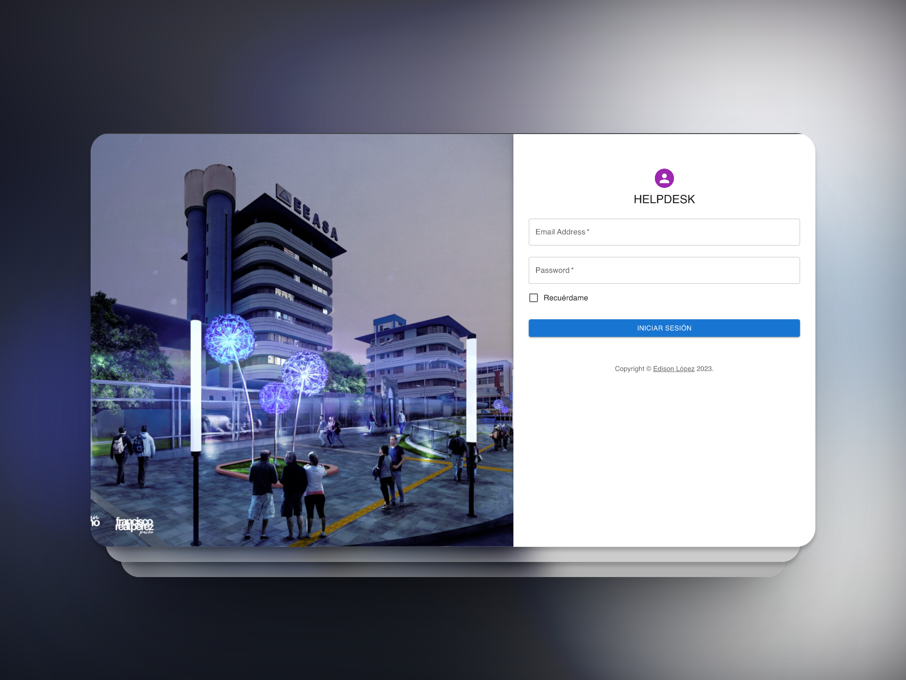

## Roles en Nuestra Plataforma

En el corazón de nuestra plataforma, se encuentra la estructura de roles cuidadosamente diseñada para optimizar la gestión de incidencias y garantizar una colaboración fluida. Presentamos tres roles distintivos que abarcan una variedad de responsabilidades, cada uno contribuyendo a un proceso de trabajo cohesionado y efectivo.

### **Administrador**

Como el pilar de la gestión, el rol de Administrador ostenta la capacidad de dar forma a la dinámica de la plataforma. Desde categorizar tickets hasta supervisar el estado de aquellos que están siendo atendidos por los técnicos, el Administrador establece la dirección y asegura la eficiencia del proceso.

#### Dashboard Administrador

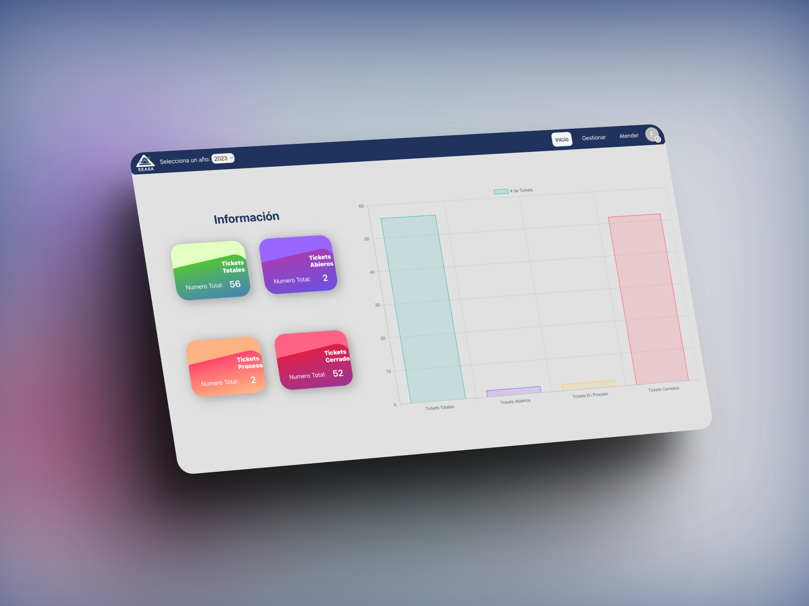

#### Tablero Kanban Administrador Gestionar

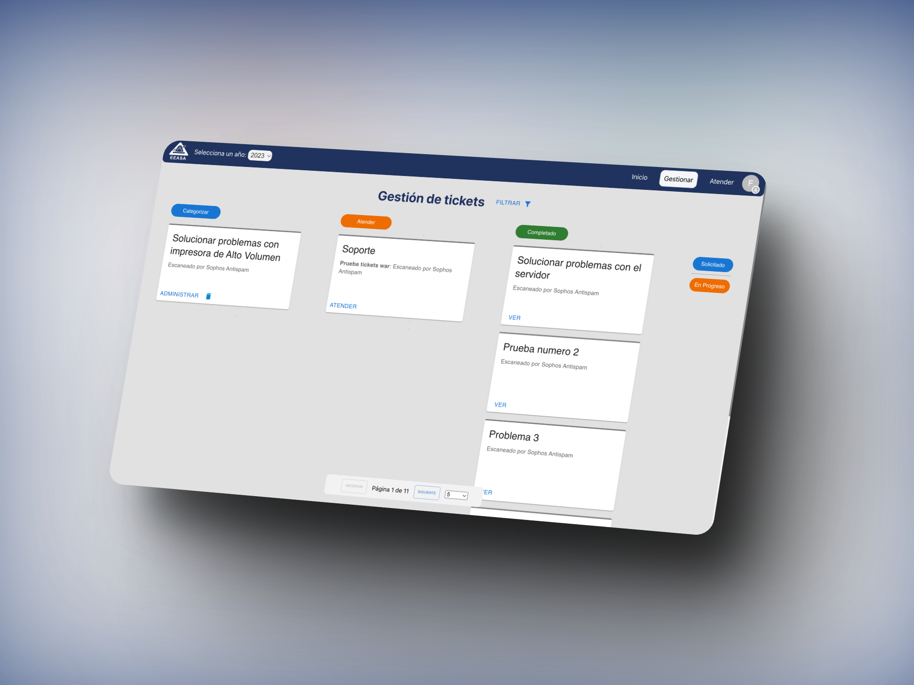

#### Tablero Kanban Administrador Atender

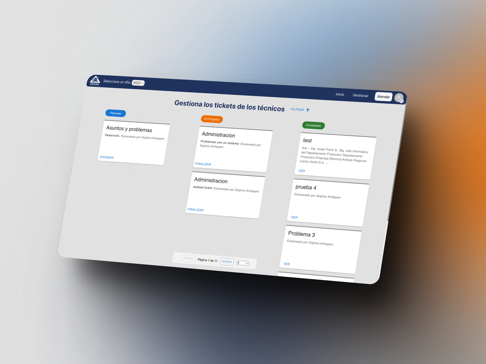

#### Ver estado de los tickets

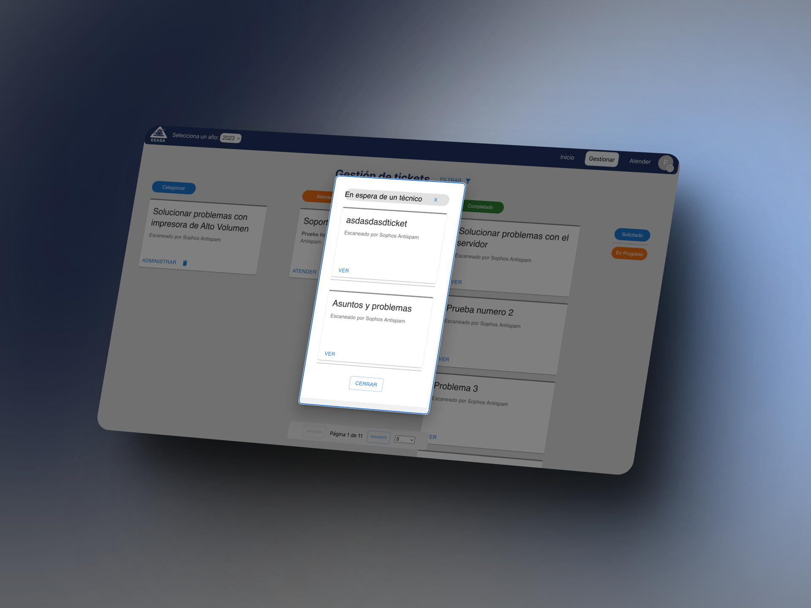

#### Filtros por Mes y Categoria

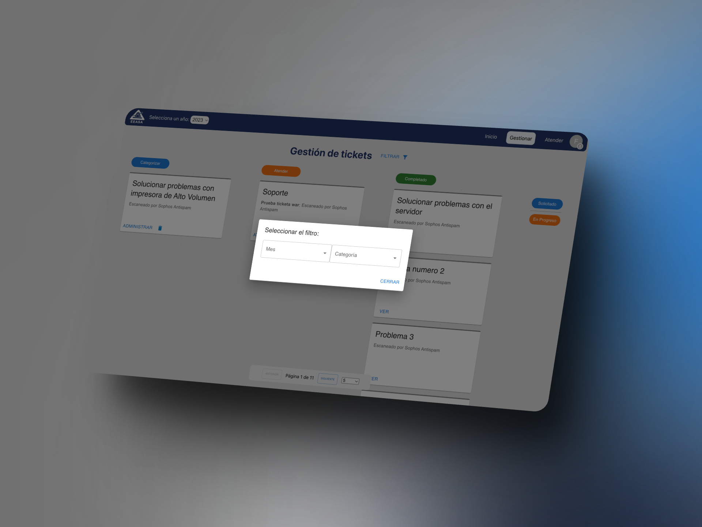

### **Técnico**

Los Técnicos son los encargados de brindar soluciones prácticas a los problemas presentados en los tickets. Con la facultad de atender las incidencias previamente categorizadas y solicitadas por el Administrador, los Técnicos aseguran una resolución oportuna y efectiva, contribuyendo a la satisfacción del usuario final.

#### Dashboard Técnico

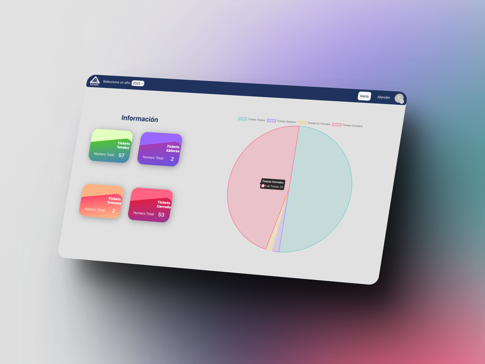

#### Atender un ticket por un Técnico

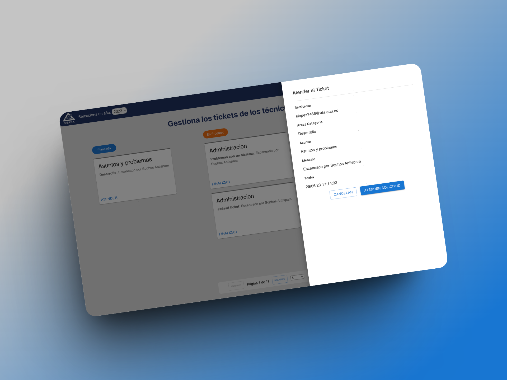

#### Finalizar un ticket por un Técnico

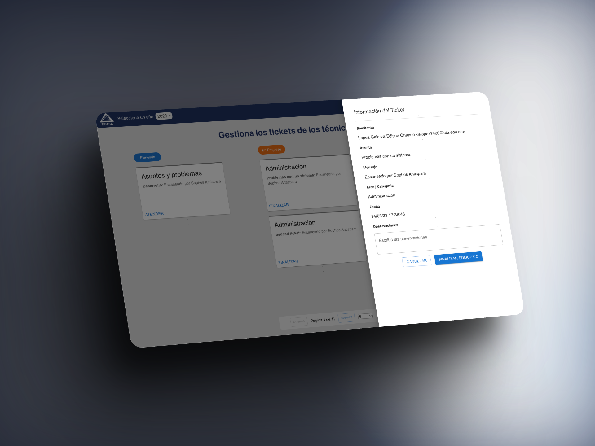

#### Tablero Kanban Técnico

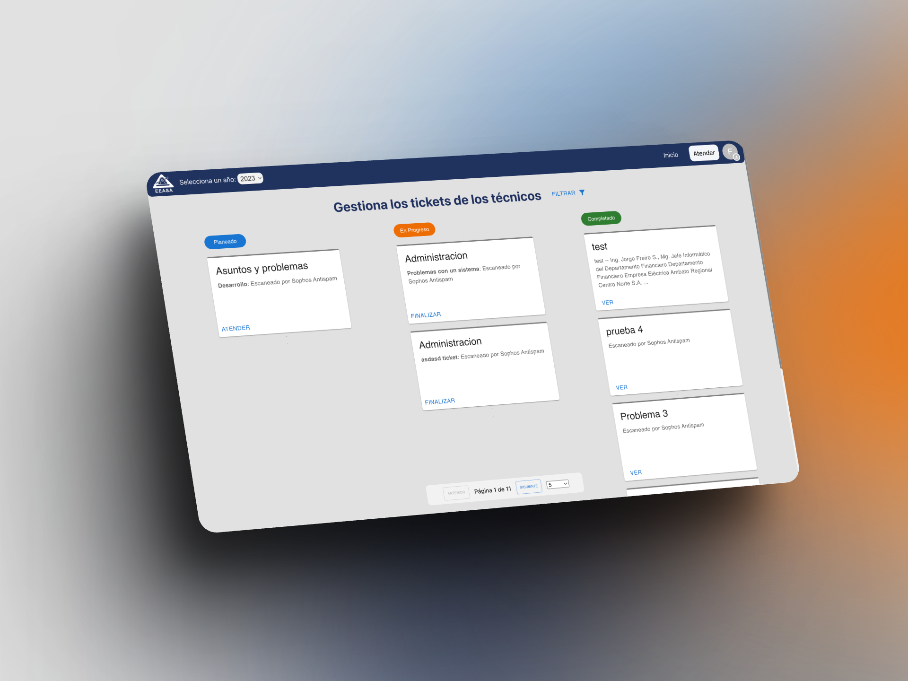

### **Categorizador**

El rol de Categorizador desempeña una función esencial en la organización y eficiencia de la plataforma. Los Categorizadores tienen la capacidad de asignar a cada incidencia una categoría específica, como soporte, infraestructura, desarrollo y administración. Esta categorización precisa facilita la gestión y la priorización adecuada.

Este sistema de roles diferenciados se interconecta en armonía, permitiendo que cada miembro del equipo aporte de manera específica a los procesos de soporte y gestión. Juntos, estos roles colaboran para lograr una operación fluida y enfocada en el usuario, asegurando que las incidencias se manejen con rapidez y profesionalismo.

¡Descubra cómo nuestra implementación de roles redefine la colaboración y optimiza la gestión de incidencias en línea con las necesidades únicas de la _Empresa Eléctrica Ambato_!

## Página 404

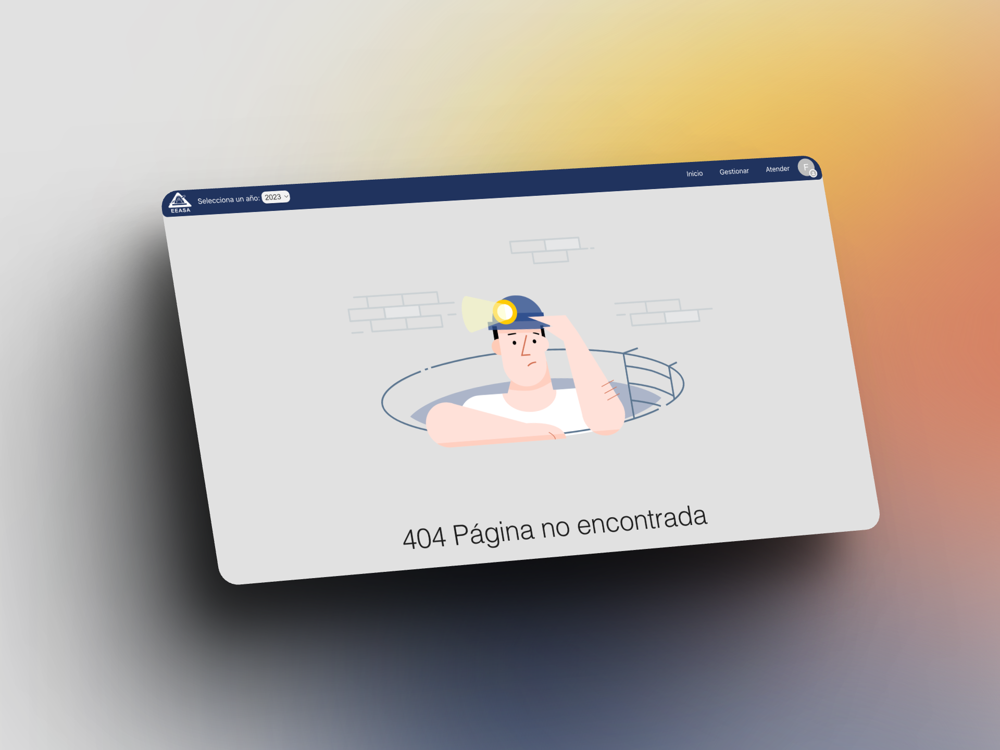
